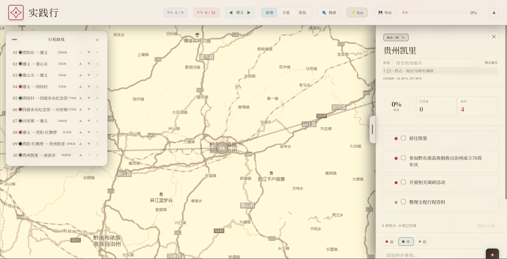
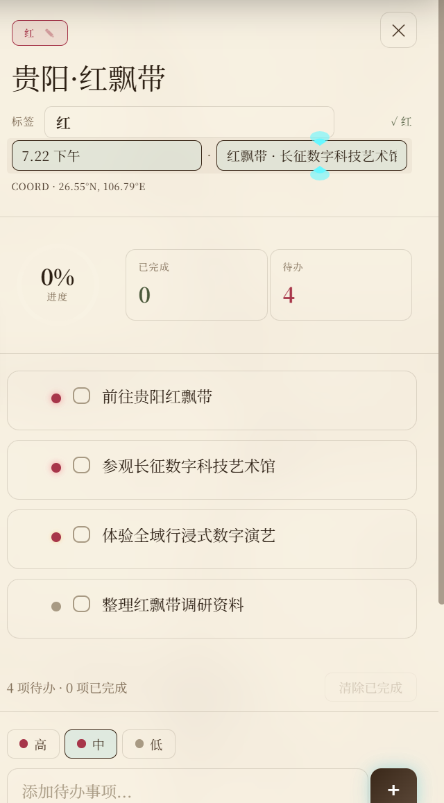
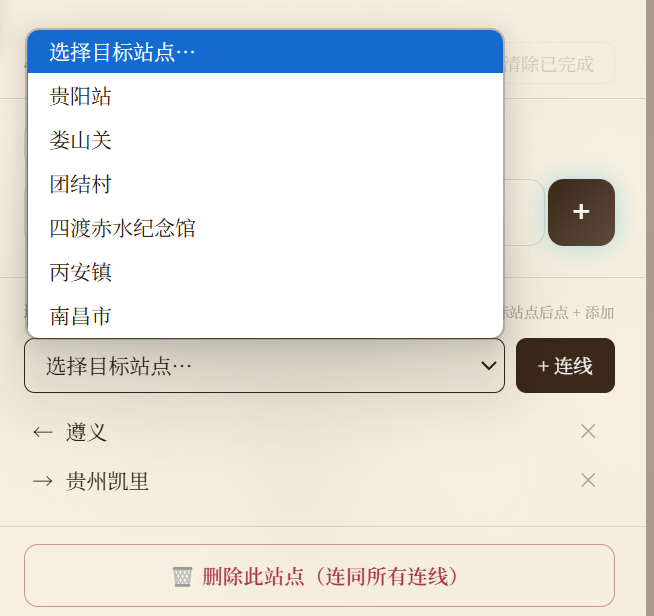

# Waymap

> A single-file route-planning map for trips, field studies, and excursions.

Drop waypoints on the map, draw polylines between them, mark each stop as done / todo, then **export the whole trip as a self-contained HTML file** — anyone can open it in a browser, no install, no server.

## Features

- Add / edit waypoints on the map
- Draw multi-segment routes by connecting stops
- Mark each stop as todo / done with progress tracking
- Search places, switch between AMap / Satellite / Dark basemaps
- Export → one HTML file (the killer feature for sharing with teammates)

## Files

| File | What it is |
|---|---|
| `实践行.html` | The app — open it in any modern browser |
| `favicon.svg` | Favicon |
| `key获取方法.txt` | How to get a free AMap Web Service API key |

## Getting started

1. Apply for a free AMap key (see `key获取方法.txt`)

2. Open `实践行.html` and paste the key when prompted

3. Start searching landmarks, drawing routes, planning stop tasks

## How to use

The right-side panel is editable — add tags and edit notes here.

Pick the next stop to add a route segment, or delete the current stop.

## Built for

Originally built for the 三下乡 (Three Goes to the Countryside) university social-practice program — but generic enough for any trip plan.
