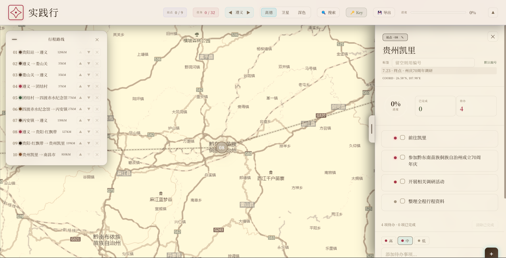
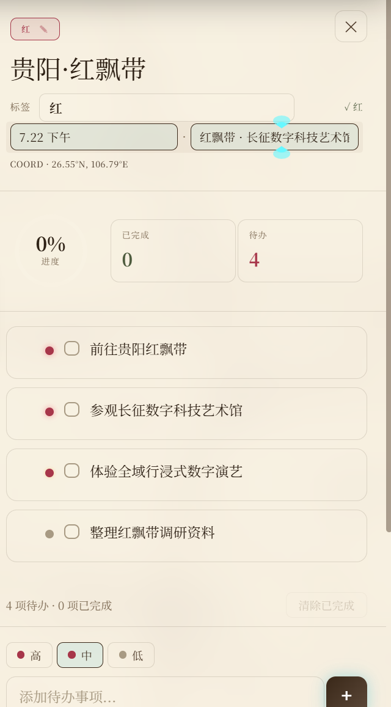
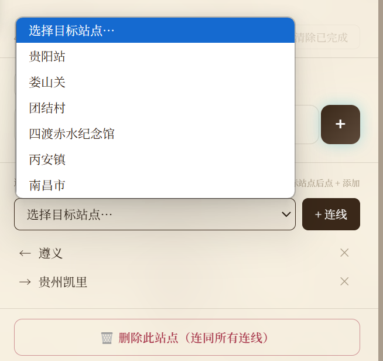

# Waymap

> A single-file route-planning map for trips, field studies, and excursions.

Drop waypoints on the map, draw polylines between them, mark each stop as done / todo, then **export the whole trip as a self-contained HTML file** — anyone can open it in a browser, no install, no server.

## Files

| File | What it is |
|---|---|
| `路图.html` | The app (lite version) — open it in any modern browser |
| `路图 - 可编辑日志版.html` | **Enhanced build**: adds the "station journal" feature on top of `路图.html` (see below) |
| `favicon.svg` | Favicon |
| `key获取方法.txt` | How to get a free AMap Web Service API key |

## Features

- Add / edit waypoints on the map
- Reorder stops in the node list; stop numbers are automatically derived from list order
- Draw multi-segment routes by connecting stops
- Mark each stop as todo / done with progress tracking
- Todos support **High / Medium / Low** priorities (red / yellow / gray)
- Search places, switch between Paper (AMap) / Satellite basemaps
- Export → one HTML file (the killer feature for sharing with teammates; exports carry all trip data)
- **Station journal (enhanced build only)**: double-click any node to open its illustrated journal — Markdown rich text, images, and sectioning

## Enhanced build · Station journal

Open `路图 - 可编辑日志版.html` and double-click a stop in the left node list to open that stop's **journal** panel:

- **WYSIWYG editing**: bold, italic, underline, lists, quotes, etc. Underline is written as `++text++`.
- **Sectioning**: one `#` heading separates journal entries (`# date · title`), with the body below it; `##` / `###` are sub-headings within an entry and never split it into separate entries.
- **Single-entry preview**: the right-side preview renders only the entry you are currently editing, for focus.
- **Three-state layout**: a bottom slider switches between "edit only / split / preview only" and remembers your last choice.
- **Windowed editor**: drag the journal panel by its title bar to move it around; the title bar has minimize / maximize / close buttons. Maximize fills the browser viewport, minimize collapses to a small bar at the bottom-right, and `Esc` closes the window.
- **Local file storage**: on first use, connect a "日志" (journal) folder (Chrome / Edge desktop). Journals are saved as `.md` files under that folder, images go to `日志/img/`; the connection is restored automatically on reload. If unavailable (e.g. opened via `file://`, mobile, or a stale handle), it re-prompts for the folder or falls back to "import / export .md".
- **Relative path display**: the panel header shows the current journal file's relative path (e.g. `日志/trip_xxx_n4.md`) instead of a "connect folder" button.

## Getting started

1. Apply for a free AMap key (see `key获取方法.txt`)

2. Open `路图.html` or `路图 - 可编辑日志版.html` and paste the key when prompted

3. Start searching landmarks, drawing routes, planning stop tasks

4. (Enhanced build) Double-click a node to write its journal; once the "日志" folder is connected, journals auto-save as Markdown

## How to use

The right-side panel is editable — add tags and edit notes here.

Pick the next stop to add a route segment, or delete the current stop.

## Built for

Originally built for the 三下乡 (Three Goes to the Countryside) university social-practice program — but generic enough for any trip plan.
